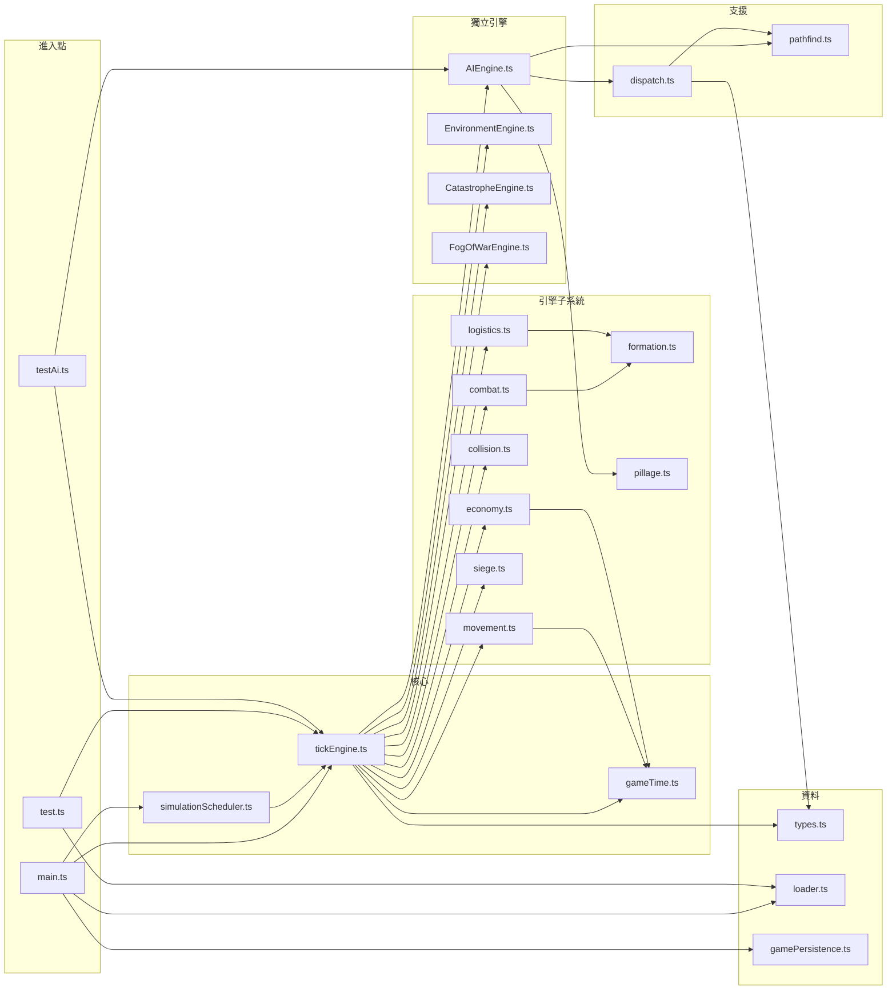
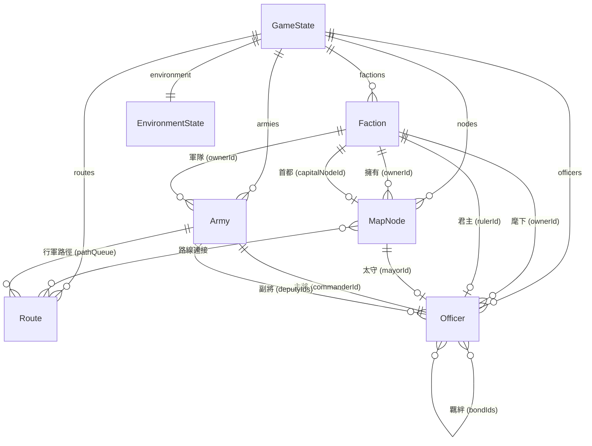
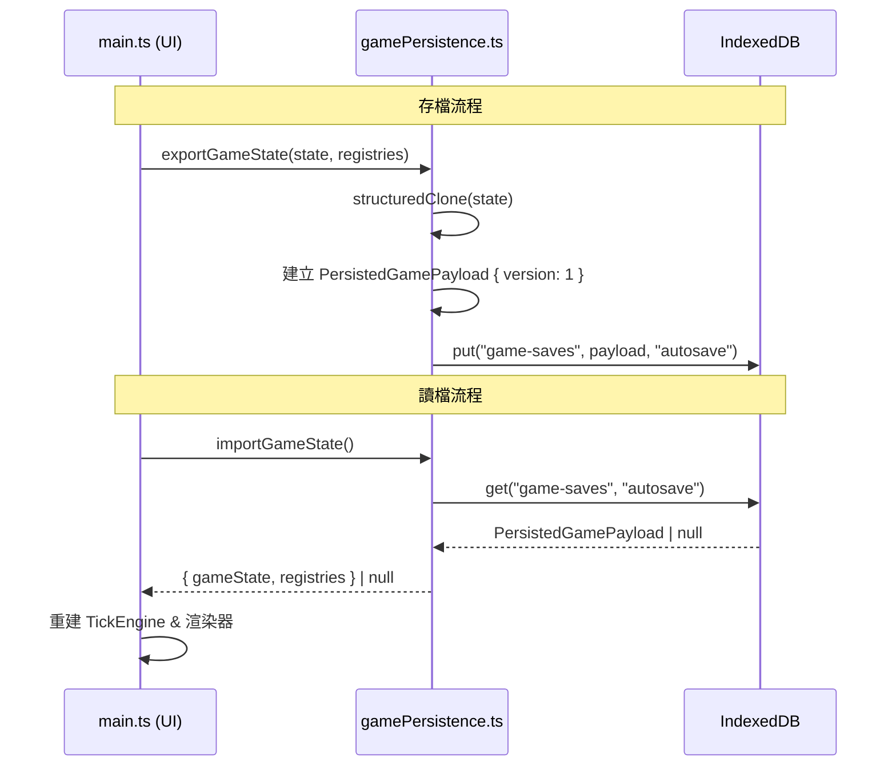
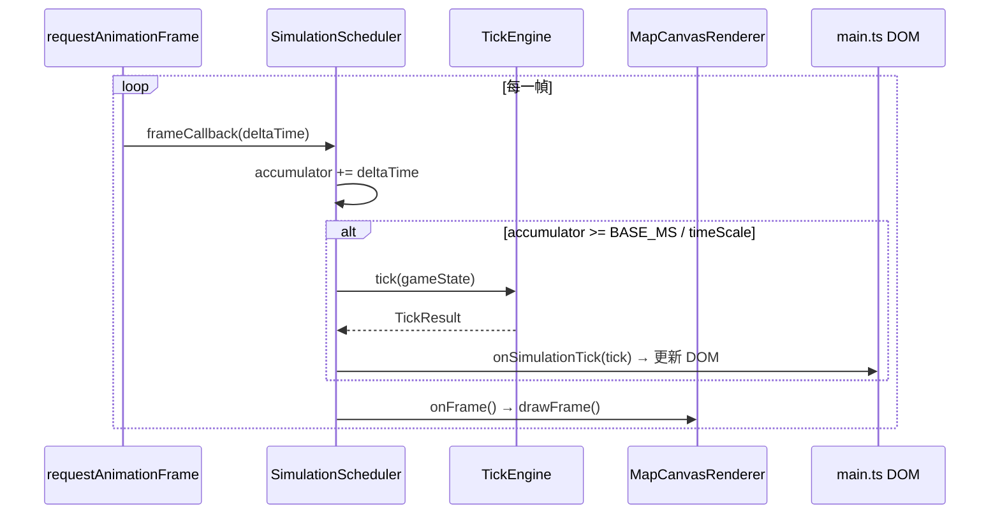
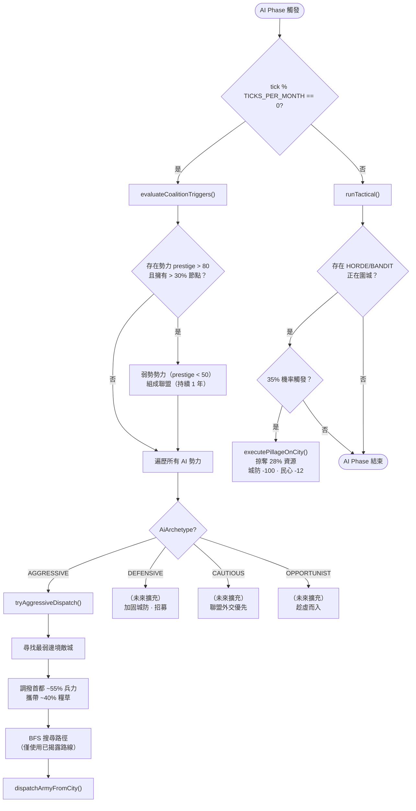

# 🐉 龍騰 Project Dragon — 系統架構文件

> **版本**: 1.0  
> **技術棧**: TypeScript · Vite · Canvas 2D · IndexedDB  
> **類型**: 三國大戰略 (Grand Strategy) 即時模擬遊戲

---

## 目錄

1. [架構總覽](#1-架構總覽)
2. [系統分層架構圖](#2-系統分層架構圖)
3. [Tick 執行流程](#3-tick-執行流程)
4. [資料流架構](#4-資料流架構)
5. [模組依賴關係](#5-模組依賴關係)
6. [資料模型與關聯](#6-資料模型與關聯)
7. [狀態管理策略](#7-狀態管理策略)
8. [持久化架構](#8-持久化架構)
9. [渲染管線](#9-渲染管線)
10. [AI 決策樹概覽](#10-ai-決策樹概覽)
11. [目錄結構與職責](#11-目錄結構與職責)
12. [未來階段擴充點](#12-未來階段擴充點)

---

## 1. 架構總覽

龍騰（Project Dragon）採用 **Headless Engine + View Layer** 分離架構，核心模擬引擎完全不依賴 DOM 或 Canvas，可獨立於 Node.js 環境執行測試。遊戲世界以 **固定時步 Tick** 驅動，每個 Tick 依序執行環境、物流、行軍、碰撞、戰鬥、圍城等子系統，確保模擬的確定性與可重現性。

### 設計原則

| 原則 | 說明 |
|------|------|
| **Headless-first** | 核心引擎零 UI 依賴，支援 Node.js 直接測試 |
| **Deterministic Tick** | 固定執行順序，相同輸入必產生相同輸出 |
| **Mutable GameState** | 單一可變狀態物件，所有子系統原地修改 |
| **Subsystem Isolation** | 各引擎子系統透過 `GameState` 介面鬆耦合 |
| **Data-driven Scenarios** | 劇本資料以 JSON 定義，引擎不硬編碼劇情 |

### Entry Points（進入點）

| 進入點 | 環境 | 用途 |
|--------|------|------|
| `index.html` → `src/main.ts` | Browser | 完整遊戲（UI + 渲染 + 引擎） |
| `src/test.ts` | Node.js (tsx) | 引擎邏輯單元測試 |
| `src/testAi.ts` | Node.js (tsx) | AI 決策邏輯測試 |
| `src/riot-test.ts` | Node.js (tsx) | 暴動與公共秩序測試 |

---

## 2. 系統分層架構圖

```mermaid
graph TB
    subgraph 表現層["表現層 (View Layer)"]
        MAIN["main.ts<br/>UI DOM 建構 · 事件處理"]
        CANVAS["mapCanvas.ts<br/>Canvas 2D 渲染器"]
        LAYOUT["mapLayout.ts<br/>節點螢幕座標"]
        ROSTER["rosterLabels.ts<br/>武將名條格式化"]
        I18N["i18n/<br/>三語系翻譯"]
        ASSET["AssetManager.ts<br/>圖片預載 Singleton"]
    end

    subgraph 排程層["排程層 (Scheduler)"]
        SCHED["simulationScheduler.ts<br/>rAF 排程器 · timeScale 1-4×"]
    end

    subgraph 核心引擎["核心引擎層 (Headless Engine)"]
        TICK["tickEngine.ts<br/>主模擬迴圈 · 子系統協調"]
        GT["gameTime.ts<br/>曆法常數 · 十二時辰"]

        subgraph 引擎子系統["引擎子系統 (src/engine/)"]
            LOGISTICS["logistics.ts<br/>糧草消耗 · 飢餓"]
            MOVEMENT["movement.ts<br/>行軍推進 · 地形修正"]
            COLLISION["collision.ts<br/>碰撞偵測"]
            COMBAT["combat.ts<br/>野戰解算 · TCP 公式"]
            SIEGE["siege.ts<br/>攻城傷害 · 城池佔領"]
            ECONOMY["economy.ts<br/>月產 · 民心 · 暴動"]
            FORMATION["formation.ts<br/>部隊編制 · 容量"]
            PILLAGE["pillage.ts<br/>掠奪機制"]
        end

        subgraph 獨立引擎["獨立引擎"]
            AI["AIEngine.ts<br/>宏觀 + 戰術 AI"]
            ENV["EnvironmentEngine.ts<br/>季節 · 天氣"]
            CAT["CatastropheEngine.ts<br/>年度災害"]
            FOW["FogOfWarEngine.ts<br/>BFS 戰霧"]
        end
    end

    subgraph 資料層["資料層 (Data Layer)"]
        TYPES["types.ts<br/>TypeScript 介面定義"]
        LOADER["loader.ts<br/>Browser JSON 載入"]
        LOADERR["loaderNode.ts<br/>Node.js 檔案載入"]
        JSON["data/stage1.json<br/>劇本資料"]
        PERSIST["gamePersistence.ts<br/>IndexedDB 存讀檔"]
    end

    subgraph 支援層["支援模組"]
        DISPATCH["dispatch.ts<br/>出兵建軍"]
        PATH["pathfind.ts<br/>BFS 路徑搜尋"]
        COMFY["ComfyUIService.ts<br/>AI 美術生成（預留）"]
    end

    MAIN --> SCHED
    SCHED --> TICK
    MAIN --> CANVAS
    CANVAS --> LAYOUT
    TICK --> GT
    TICK --> LOGISTICS & MOVEMENT & COLLISION & COMBAT & SIEGE & ECONOMY
    TICK --> AI & ENV & CAT & FOW
    TICK --> TYPES
    LOADER --> JSON
    LOADERR --> JSON
    MAIN --> PERSIST
    DISPATCH --> PATH
```



---

## 3. Tick 執行流程

每個 Tick 代表遊戲世界中的一個時辰（約 833ms 壁鐘時間 @1× 速度）。以下為 `tickEngine.ts` 中 `tick()` 方法的完整執行順序：

```mermaid
flowchart TD
    START(["Tick 開始"]) --> INC["① currentTick += 1"]
    INC --> ENV_PHASE["② EnvironmentEngine<br/>季節更新 · 路線天氣輪轉"]
    ENV_PHASE --> FOW_PHASE["③ FogOfWarEngine<br/>BFS 可見度重算"]
    FOW_PHASE --> PLAGUE["④ 瘟疫衰減<br/>城池駐軍遞減"]
    PLAGUE --> PHASE_A["⑤ Phase A: Logistics<br/>糧草消耗 · 飢餓士氣懲罰"]
    PHASE_A --> PRUNE1["⑥ 清理已消亡軍隊登錄"]
    PRUNE1 --> PREP["⑦ 行軍路線排程<br/>startNextRouteIfNeeded()"]
    PREP --> PHASE_B["⑧ Phase B: Movement<br/>推進行軍進度"]
    PHASE_B --> ARRIVAL["⑨ 抵達偵測<br/>完成當前路線段"]
    ARRIVAL --> PHASE_C["⑩ Phase C: Collision<br/>軍隊碰撞 → COMBAT / SIEGE"]
    PHASE_C --> STATIONED["⑪ 駐軍衝突解算<br/>同一節點敵軍觸發戰鬥"]
    STATIONED --> PHASE_D["⑫ Phase D: Combat<br/>野戰解算（TCP 公式 · 撤退 · 俘虜）"]
    PHASE_D --> PHASE_E["⑬ Phase E: Siege<br/>攻城傷害（50% 城防 / 50% 駐軍）"]
    PHASE_E --> MONTHLY{"⑭ tick % 720 == 0?"}
    MONTHLY -- 是 --> ECON["Economy Phase<br/>城池產出 · 民心 · 暴動 · 天子威望 · 政令效果"]
    MONTHLY -- 否 --> YEARLY
    ECON --> YEARLY{"⑮ tick % 8640 == 0?"}
    YEARLY -- 是 --> CATA["Catastrophe Phase<br/>蝗災 / 瘟疫 / 地形災變"]
    YEARLY -- 否 --> AI_PHASE
    CATA --> AI_PHASE["⑯ AI Phase<br/>Macro: 月度派兵 · 聯盟<br/>Tactical: 預留"]
    AI_PHASE --> PRUNE2["⑰ 最終登錄清理"]
    PRUNE2 --> SYNC["⑱ 同步武將位置<br/>根據軍隊狀態更新 locationId"]
    SYNC --> RESULT(["返回 TickResult<br/>（含所有變更日誌）"])
```



### 時間常數

| 常數 | 值 | 說明 |
|------|-----|------|
| `TICKS_PER_CALENDAR_DAY` | 24 | 對應十二時辰 × 2（上/下半時辰） |
| `TICKS_PER_MONTH` | 720 | 30 日 |
| `TICKS_PER_YEAR` | 8640 | 360 日（傳統曆法） |
| `MARCH_FRACTION_PER_TICK` | ~0.0625 | 每 Tick 行軍基礎推進比例 |
| `BASE_MS_PER_TICK` | ~833ms | 壁鐘時間 @1× 速度 |

---

## 4. 資料流架構

```mermaid
flowchart LR
    subgraph 載入["遊戲初始化"]
        JSON_FILE["data/stage1.json"]
        LOADER_MOD["loader.ts / loaderNode.ts"]
        NORMALIZE["正規化<br/>（補齊預設欄位）"]
    end

    subgraph 執行["遊戲執行期"]
        GS["GameState<br/>（單一可變物件）"]
        TE["TickEngine.tick()"]
        TR["TickResult<br/>（變更日誌）"]
    end

    subgraph 輸出["表現 & 持久化"]
        UI["main.ts<br/>DOM 更新"]
        CANVAS_R["mapCanvas.ts<br/>Canvas 繪製"]
        IDB["IndexedDB<br/>autosave"]
    end

    JSON_FILE --> LOADER_MOD --> NORMALIZE --> GS
    GS -->|每 Tick 傳入| TE
    TE -->|原地修改| GS
    TE -->|產生| TR
    TR --> UI
    GS --> CANVAS_R
    GS -->|exportGameState()| IDB
    IDB -->|importGameState()| GS
```

---

## 5. 模組依賴關係



---

## 6. 資料模型與關聯

### 核心 Entity 關聯圖



### 主要介面定義

#### `GameState`（遊戲主狀態）

```typescript
interface GameState {
  currentTick: number;
  officers: Record<string, Officer>;
  nodes: Record<string, MapNode>;
  routes: Record<string, Route>;
  armies: Record<string, Army>;
  factions: Record<string, Faction>;
  environment: EnvironmentState;
  playerFactionId: string;
  aiSession: AiSessionState;
  revealedRouteIds: string[];
}
```

#### `Officer`（武將）

| 欄位 | 類型 | 說明 |
|------|------|------|
| `id` / `name` | `string` | 識別與名稱 |
| `stats` | `{ command, martial, intel, politics, luck }` | 五維屬性 |
| `trait` | `string` | 特性標籤 |
| `status` | `OfficerStatus` | `IDLE` · `MARCHING` · `COMBAT` · `SIEGE` · `CAPTURED` |
| `loyalty` / `ambition` | `number` | 忠誠度與野心值 |
| `bondIds` | `string[]` | 羈絆武將 ID |
| `feudFactionId` | `string \| null` | 宿怨勢力 |

#### `MapNode`（城池 / 關隘）

| 欄位 | 類型 | 說明 |
|------|------|------|
| `type` | `"CITY" \| "GATE"` | 節點類型 |
| `defense` / `maxDefense` | `number` | 當前 / 最大城防 |
| `resources` | `{ gold, food, troops }` | 城池資源 |
| `policy` | `CityPolicy` | 施政方針（影響月產） |
| `publicOrder` | `number` | 民心（低於閾值觸發暴動） |
| `hasEmperor` | `boolean` | 是否有天子（→ 威望加成） |
| `isPlagued` | `boolean` | 瘟疫狀態 |

#### `Army`（軍隊）

| 欄位 | 類型 | 說明 |
|------|------|------|
| `troops` | `{ cavalry, infantry, archer }` | 三兵種編制 |
| `morale` / `stamina` | `number` | 士氣與體力 |
| `status` | `ArmyStatus` | `IDLE` · `MARCHING` · `COMBAT` · `SIEGE` |
| `pathQueue` | `string[]` | BFS 路徑佇列（Route ID） |
| `progress` | `number` | 當前路線推進度（0–1） |
| `combatEngagement` | `object \| null` | 交戰資訊（初始兵力 · 撤退閾值） |

#### 列舉型別

```typescript
type FactionKind   = "WARLORD" | "HORDE" | "BANDIT" | "PIRATE"
type AiArchetype   = "AGGRESSIVE" | "DEFENSIVE" | "CAUTIOUS" | "OPPORTUNIST"
type RouteType     = "PLAIN" | "MOUNTAIN" | "WATER"
type RouteWeather  = "CLEAR" | "RAIN" | "SNOW" | "FOG"
type Season        = "SPRING" | "SUMMER" | "AUTUMN" | "WINTER"
type NodeVisibility = "FULL" | "ESTIMATE" | "BLIND"
type CityPolicy    = "POLICY_FOCUS_GOLD" | "POLICY_FOCUS_FOOD" | "POLICY_FOCUS_DRAFT"
                   | "POLICY_BALANCED" | "POLICY_RESTORE_ORDER"
type ActiveEdict   = "NONE" | "EDICT_TUNTIAN" | "EDICT_CONSCRIPTION" | "EDICT_MERITOCRACY"
```

---

## 7. 狀態管理策略

### 設計選擇：Mutable GameState

本專案採用 **單一可變 GameState 物件** 作為全域遊戲狀態容器。所有子系統於每個 Tick 中直接修改此物件。

```
┌────────────────────────────────────┐
│           GameState                │
│  ┌──────────┐  ┌───────────────┐  │
│  │ officers  │  │    nodes      │  │
│  │ Record<>  │  │   Record<>    │  │
│  └──────────┘  └───────────────┘  │
│  ┌──────────┐  ┌───────────────┐  │
│  │  armies   │  │    routes     │  │
│  │ Record<>  │  │   Record<>    │  │
│  └──────────┘  └───────────────┘  │
│  ┌──────────┐  ┌───────────────┐  │
│  │ factions  │  │ environment   │  │
│  │ Record<>  │  │ SeasonState   │  │
│  └──────────┘  └───────────────┘  │
│  currentTick · playerFactionId    │
│  aiSession · revealedRouteIds     │
└────────────────────────────────────┘
```

**優點：**

- **效能**：無需每 Tick 深拷貝整個狀態樹，適合高頻模擬
- **簡潔**：子系統直接讀寫，無需 action/reducer 間接層
- **確定性**：固定執行順序確保無競態條件

**注意事項：**

- 狀態一致性由 Tick 執行順序保證，非由型別系統保證
- 持久化時使用 `structuredClone()` 建立快照，避免引用汙染

### 引擎登錄表（Engine Registries）

`TickEngine` 內部維護三個輔助 Registry，追蹤軍隊的即時狀態：

| Registry | 類型 | 用途 |
|----------|------|------|
| `stations` | `Map<armyId, nodeId>` | 駐軍所在節點 |
| `sieges` | `Map<armyId, nodeId>` | 圍城中的軍隊 |
| `combats` | `Map<armyId, opponentArmyId>` | 交戰配對 |

這些登錄表與 `GameState` 一同持久化，確保存讀檔後引擎狀態一致。

---

## 8. 持久化架構



### 持久化資料結構

```typescript
interface PersistedGamePayload {
  version: 1;                           // 前向相容版本號
  gameState: GameState;                  // 完整遊戲狀態快照
  registries: EngineRegistrySnapshot;    // 引擎登錄表快照
}

interface EngineRegistrySnapshot {
  stations: Record<string, string>;      // armyId → nodeId
  sieges: Record<string, string>;        // armyId → nodeId
  combats: Record<string, string>;       // armyId → opponentArmyId
}
```

**儲存規格：**

| 項目 | 值 |
|------|-----|
| Backend | IndexedDB |
| 資料庫名稱 | `"project-dragon-db"` |
| Object Store | `"game-saves"` |
| Key | `"autosave"`（單一自動存檔槽） |
| 序列化方式 | `structuredClone()` |

---

## 9. 渲染管線

### Canvas 2D 繪製流程

`MapCanvasRenderer.drawFrame()` 每幀由 `requestAnimationFrame` 觸發：

```
┌─────────────────────────────────────────────────┐
│  drawFrame()                                    │
│                                                 │
│  ① ctx.clearRect()      — 清除畫布              │
│           ↓                                     │
│  ② drawRoutes()         — 繪製路線              │
│     ├─ 過濾隱藏路線（除非已揭露）                  │
│     ├─ 地形色彩：PLAIN #b45309                   │
│     │              MOUNTAIN #713f12              │
│     │              WATER #2563eb                 │
│     ├─ 線寬：PLAIN 6px / MOUNTAIN 3px / WATER 5px│
│     └─ Bézier 曲線連接節點                       │
│           ↓                                     │
│  ③ drawNodes()          — 繪製城池 / 關隘        │
│     ├─ 勢力色彩填充（蜀 #15803d / 敵 #b91c1c）   │
│     ├─ 駐軍兵力徽章                              │
│     └─ 圍城 / 瘟疫狀態圖示                       │
│           ↓                                     │
│  ④ drawArmies()         — 繪製行軍部隊           │
│     ├─ MARCHING: 路線上動畫插值（progress 0–1）   │
│     ├─ COMBAT/SIEGE: 固定於節點                  │
│     └─ 兵種編制徽章（騎/步/弓）                   │
│                                                 │
└─────────────────────────────────────────────────┘
```

**DPI 適配：** 使用 `window.devicePixelRatio` 縮放 Canvas 解析度，確保 Retina 顯示器清晰度。

**節點座標：** `mapLayout.ts` 中 `NODE_SCREEN_POSITIONS` 預先定義所有節點的螢幕 `(x, y)` 座標，無需即時佈局計算。

### 排程器與渲染整合



**速度控制：**

| timeScale | 每 Tick 壁鐘時間 | 每秒約 Tick 數 |
|-----------|-----------------|---------------|
| 1× | ~833ms | 1.2 |
| 2× | ~416ms | 2.4 |
| 3× | ~277ms | 3.6 |
| 4× | ~208ms | 4.8 |

**防跳幀保護：** 單幀最多執行 12 個 Tick，避免長時間暫停後的突發運算。

---

## 10. AI 決策樹概覽



### AI 決策層級

| 層級 | 頻率 | 職責 |
|------|------|------|
| **Macro** | 每月（720 Ticks） | 勢力級決策：聯盟形成、攻城派兵 |
| **Tactical** | 每 Tick | 戰場級決策：撤退判斷、掠奪觸發（目前部分實作） |

---

## 11. 目錄結構與職責

```
/home/runner/work/GDragon/GDragon/
│
├── index.html                      # 瀏覽器進入點 HTML
├── package.json                    # NPM 依賴與腳本
├── tsconfig.json                   # TypeScript 編譯配置
├── vite.config.ts                  # Vite 建置配置
│
├── data/
│   └── stage1.json                 # Stage 1 劇本資料（勢力·城池·武將·路線）
│
├── src/
│   ├── main.ts                     # 🎮 UI 主程式：DOM 建構·事件處理·模態框
│   ├── tickEngine.ts               # ⚙️ 核心模擬迴圈：子系統協調·TickResult 產生
│   ├── simulationScheduler.ts      # ⏱️ rAF 排程器：timeScale·暫停·防跳幀
│   ├── gameTime.ts                 # 📅 曆法常數：十二時辰·月·年·季節計算
│   ├── types.ts                    # 📐 TypeScript 介面與型別別名定義
│   │
│   ├── mapCanvas.ts                # 🗺️ Canvas 2D 地圖渲染器
│   ├── mapLayout.ts                # 📍 節點螢幕座標預定義
│   ├── rosterLabels.ts             # 📋 武將名條格式化工具
│   │
│   ├── loader.ts                   # 📥 Browser JSON 載入與正規化
│   ├── loaderNode.ts               # 📥 Node.js 檔案載入（測試用）
│   ├── gamePersistence.ts          # 💾 IndexedDB 存讀檔
│   │
│   ├── AIEngine.ts                 # 🤖 AI 決策引擎（Macro + Tactical）
│   ├── EnvironmentEngine.ts        # 🌦️ 季節循環·路線天氣生成
│   ├── CatastropheEngine.ts        # 💥 年度災害（蝗災·瘟疫·地形災變）
│   ├── FogOfWarEngine.ts           # 🌫️ BFS 戰霧（FULL/ESTIMATE/BLIND）
│   │
│   ├── dispatch.ts                 # ⚔️ 出兵建軍（從城池駐軍調撥）
│   ├── pathfind.ts                 # 🧭 BFS 路徑搜尋
│   ├── AssetManager.ts             # 🖼️ Singleton 圖片預載管理器
│   ├── ComfyUIService.ts           # 🎨 AI 美術生成服務（預留介面）
│   │
│   ├── test.ts                     # 🧪 引擎邏輯測試（Node.js）
│   ├── testAi.ts                   # 🧪 AI 決策測試（Node.js）
│   ├── riot-test.ts                # 🧪 暴動機制測試（Node.js）
│   │
│   ├── engine/                     # 引擎子系統模組
│   │   ├── logistics.ts            #   糧草消耗·飢餓·士氣/體力衰減
│   │   ├── movement.ts             #   行軍推進·地形/天氣/規模修正
│   │   ├── collision.ts            #   碰撞偵測（→ COMBAT 或 → SIEGE）
│   │   ├── combat.ts               #   野戰解算·TCP 公式·撤退·俘虜
│   │   ├── siege.ts                #   攻城傷害·城池佔領觸發
│   │   ├── economy.ts              #   月產·民心·暴動·天子威望
│   │   ├── formation.ts            #   部隊編制計算（容量上限·糧耗）
│   │   └── pillage.ts              #   掠奪機制（HORDE/BANDIT 即時搶掠）
│   │
│   ├── i18n/                       # 國際化模組
│   │   ├── i18n.ts                 #   翻譯介面與查詢函式
│   │   ├── localeId.ts             #   支援語系定義
│   │   └── messages/               #   各語系翻譯資料
│   │
│   └── assets/                     # 靜態資源
│       ├── hero.png
│       ├── vite.svg
│       └── typescript.svg
│
├── dist/                           # Vite 建置輸出
│
├── phase1-4-spec.md                # 規格書：核心引擎·資料模型·物流公式
├── phase5-6-spec.md                # 規格書：UI 渲染·Canvas·名條
├── phase7-9-spec.md                # 規格書：行軍·野戰·攻城
├── phase10-12-spec.md              # 規格書：經濟·民心·災害
└── phase13-15-spec.md              # 規格書：外交·聯盟·政令·勝敗條件
```

---

## 12. 未來階段擴充點

基於現有架構與規格書（phase13-15-spec.md），以下為已規劃或建議的擴充方向：

### 12.1 外交系統擴充

| 擴充項目 | 實作建議 |
|----------|----------|
| **聯盟（Alliance）** | 擴充 `Faction.allianceId`，新增 `src/engine/diplomacy.ts` 處理結盟/破盟邏輯 |
| **停戰協定** | 在 `GameState` 新增 `truces: Record<string, TruceAgreement>` |
| **朝貢關係** | 新增 `tributeRelations` 追蹤附庸狀態 |

### 12.2 AI 行為擴充

| 擴充項目 | 實作建議 |
|----------|----------|
| **DEFENSIVE Archetype** | 在 `AIEngine.ts` 實作城防強化與招募邏輯 |
| **CAUTIOUS Archetype** | 優先尋求聯盟，避免正面衝突 |
| **OPPORTUNIST Archetype** | 偵測鄰國戰爭狀態，趁虛攻擊 |
| **戰術層 AI** | `runTactical()` 實作撤退判斷、援軍調度、夾擊協調 |

### 12.3 遊戲機制擴充

| 擴充項目 | 建議位置 | 說明 |
|----------|----------|------|
| **勝利/敗北條件** | `tickEngine.ts` | 統一天下判定、勢力滅亡檢查 |
| **政令系統深化** | `engine/economy.ts` | 擴充 `ActiveEdict` 效果計算 |
| **武將技能樹** | `types.ts` + 新模組 | 擴充 `Officer.trait` 為完整技能系統 |
| **水戰系統** | `engine/combat.ts` | 依據 `RouteType.WATER` 切換戰鬥公式 |
| **城池建設** | `engine/economy.ts` | 建築系統影響產出與防禦 |

### 12.4 技術架構擴充

| 擴充項目 | 實作建議 |
|----------|----------|
| **多存檔槽** | 擴充 `gamePersistence.ts`，改用動態 Key 替代固定 `"autosave"` |
| **回放系統** | 記錄每 Tick 的 `TickResult`，支援戰役重播 |
| **WebSocket 多人** | 抽象 `TickEngine.tick()` 為 Server-authoritative 模式 |
| **WebGL 渲染** | 替換 Canvas 2D 為 WebGL（或 PixiJS），支援更大地圖 |
| **Worker Thread** | 將 `TickEngine` 遷移至 Web Worker，避免 UI 阻塞 |
| **AI 美術整合** | 完成 `ComfyUIService.ts` 與 Stable Diffusion 串接 |

### 12.5 擴充點介面設計原則

新增子系統應遵循現有模式：

```typescript
// 新子系統範例：diplomacy.ts
export interface DiplomacyLog {
  type: "ALLIANCE_FORMED" | "TRUCE_SIGNED" | "TRIBUTE_PAID";
  // ...
}

export function runDiplomacyPhase(state: GameState): DiplomacyLog[] {
  // 直接修改 state，回傳變更日誌
}
```

在 `tickEngine.ts` 的適當位置插入呼叫：

```typescript
// tick() 方法中
const diplomacyLogs = runDiplomacyPhase(state);  // 新增於 Economy 之後
```

---

> 📌 **維護提醒：** 本文件應隨程式碼演進同步更新。主要更新觸發點：新增引擎子系統、修改 Tick 執行順序、變更資料模型結構。
