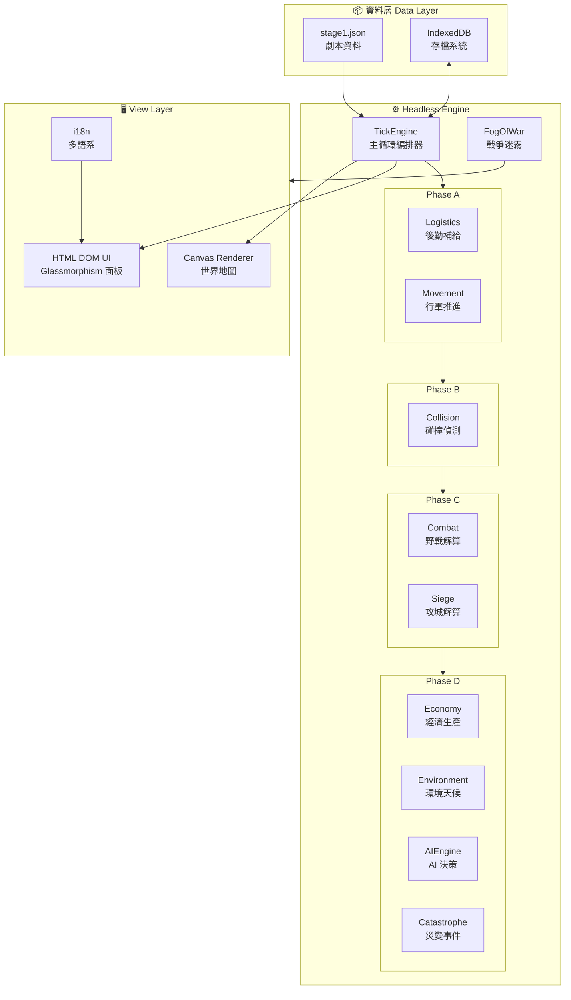

<p align="center">
  <h1 align="center">Project Dragon · 龍騰</h1>
  <p align="center">
    三國大戰略遊戲引擎 — Three Kingdoms Grand Strategy Engine
  </p>
  <p align="center">
    <!-- TODO: 連接至 GitHub Actions 後取消註解 -->
    <!--  -->
    
    
    
    
    
  </p>
</p>

---

## 📖 專案概覽

**Project Dragon（龍騰）** 是一款以東漢末年三國時期為背景的大戰略模擬遊戲。採用 **Headless Engine** 架構設計，將遊戲邏輯與渲染層完全分離，實現可測試、可擴展、可序列化的純 TypeScript 遊戲引擎。

遊戲以 **Tick-based 模擬系統**驅動，涵蓋後勤補給、行軍移動、野戰攻城、經濟生產、AI 決策、戰爭迷霧、環境天候、災變事件及地緣政治等多重系統，力求還原三國時代的戰略博弈體驗。

### 設計理念

- **零外部執行時依賴** — 不依賴任何遊戲引擎或 UI 框架，純 Vanilla TypeScript 實作
- **確定性引擎** — 相同輸入必定產生相同輸出，完美支援存檔/讀檔與重播
- **模組化子系統** — 每個遊戲系統皆為獨立可測試的模組

---

## ✨ 核心特性

| 類別 | 特性 |
|------|------|
| 🎯 **引擎架構** | Headless Engine 設計，邏輯與渲染完全解耦 |
| ⏱️ **Tick 模擬** | 24 ticks/日、720 ticks/月、8640 ticks/年，可調速（1x/2x/4x） |
| ⚔️ **戰鬥系統** | 野戰 TCP 公式、攻城戰（城牆/守軍雙軌損耗）、俘虜機制 |
| 🚚 **後勤系統** | 糧食消耗、飢餓懲罰、士氣系統 |
| 🗺️ **行軍系統** | 地形速度修正、兵種差異（騎兵/步兵/弓兵）、規模減速 |
| 💰 **經濟系統** | 城池月產出、政策導向（重金/重糧/徵兵/均衡） |
| 🤖 **AI 引擎** | 四大原型（AGGRESSIVE / DEFENSIVE / CAUTIOUS / OPPORTUNIST） |
| 🌫️ **戰爭迷霧** | FULL/ESTIMATE/BLIND 三級可見度、間諜偵察 |
| 🌦️ **環境引擎** | 四季循環、天候系統（晴/雨/雪/霧）、動態事件 |
| 💥 **災變引擎** | 蝗災、瘟疫、地震、洪水等隨機天災事件 |
| 🏛️ **地緣政治** | 勢力類型（群雄/遊牧/盜賊/海寇）、擁帝、聯盟、詔令 |
| 🎨 **Canvas 渲染** | 原生 Canvas 世界地圖 + Glassmorphism HTML DOM UI |
| 💾 **資料持久化** | IndexedDB 自動存檔（每 30 ticks）、手動存讀檔 |
| 🌐 **多語系支援** | 繁體中文、簡體中文、English |
| 🖼️ **AI 美術接口** | ComfyUI Service 預留 AI 生成圖像管線 |

---

## 🏗️ 架構概覽



### Tick 執行流程

每個遊戲 Tick 按固定順序執行以下階段：

```
Tick N
├── Phase A: 後勤補給 → 糧食消耗、飢餓檢查、行軍推進
├── Phase B: 碰撞偵測 → 軍隊-城池/軍隊-軍隊碰撞判定
├── Phase C: 戰鬥解算 → 野戰傷害計算、攻城牆體/守軍損耗
├── Phase D: 週期事件 → 月度經濟、季節更替、AI 決策、災變檢查
└── Render: 重繪 Canvas + 更新 DOM UI
```

---

## 🛠️ 技術棧

| 層級 | 技術 | 用途 |
|------|------|------|
| **語言** | TypeScript 5.9（Strict Mode） | 型別安全的遊戲邏輯 |
| **建置工具** | Vite 5.x | 開發伺服器、HMR、Production Build |
| **執行環境** | 純瀏覽器（Vanilla JS） | 零外部 Runtime 依賴 |
| **渲染** | Canvas 2D API | 世界地圖繪製 |
| **UI** | 原生 HTML DOM + CSS | Glassmorphism 風格介面 |
| **字型** | Noto Sans TC / Roboto | 中文/英文顯示 |
| **持久化** | IndexedDB | 遊戲存檔與讀取 |
| **測試執行** | tsx | TypeScript 直接執行測試 |
| **美術管線** | ComfyUI（預留接口） | 未來 AI 圖像生成 |

---

## 🚀 快速開始

### 系統需求

- **Node.js** ≥ 18.x
- **npm** ≥ 9.x

### 安裝與啟動

```bash
# 複製專案
git clone https://github.com/<owner>/GDragon.git
cd GDragon

# 2. 安裝依賴
npm install

# 3. 啟動開發伺服器
npm run dev
# → 開啟瀏覽器訪問 http://localhost:5173

# 4. 建置生產版本
npm run build

# 5. 預覽生產版本
npm run preview
# → 開啟瀏覽器訪問 http://localhost:4173
```

### 可用指令

| 指令 | 說明 |
|------|------|
| `npm run dev` | 啟動 Vite 開發伺服器（port 5173，支援 HMR） |
| `npm run build` | TypeScript 編譯 + Vite 建置（輸出至 `dist/`） |
| `npm run preview` | 預覽生產建置結果（port 4173） |
| `npm run test:engine` | 執行引擎自測（派兵、戰鬥流程驗證） |
| `npm run test:ai` | 執行 AI 決策測試（900 ticks 模擬） |
| `npm run test:riot` | 執行暴動/災變事件測試 |

---

## 📁 專案結構

```
GDragon/
├── src/                            # 原始碼根目錄
│   ├── main.ts                     # 應用程式入口，UI 掛載、事件綁定
│   ├── types.ts                    # 所有核心介面定義（Officer, Army, MapNode …）
│   ├── tickEngine.ts               # Tick 主迴圈編排器
│   ├── gameState.ts                # 遊戲狀態管理
│   ├── gameMeta.ts                 # 劇本中繼資料
│   ├── gameTime.ts                 # 曆法與 Tick 時間轉換
│   ├── gamePersistence.ts          # IndexedDB 存讀檔
│   │
│   ├── AIEngine.ts                 # 勢力 AI（宏觀月度 + 微觀戰術）
│   ├── EnvironmentEngine.ts        # 季節、天候、動態事件
│   ├── FogOfWarEngine.ts           # 戰爭迷霧可見度
│   ├── CatastropheEngine.ts        # 災變事件引擎
│   ├── AssetManager.ts             # 圖像資源預載與降級處理
│   ├── ComfyUIService.ts           # AI 美術生成服務（預留）
│   │
│   ├── engine/                     # 子系統引擎模組
│   │   ├── logistics.ts            #   後勤補給：糧食消耗、飢餓懲罰
│   │   ├── movement.ts             #   行軍推進：路線進度、速度修正
│   │   ├── collision.ts            #   碰撞偵測：軍隊 vs 城池/軍隊
│   │   ├── combat.ts               #   野戰解算：傷害公式、俘虜判定
│   │   ├── siege.ts                #   攻城解算：城牆/守軍雙軌損耗
│   │   ├── economy.ts              #   經濟生產：月度產出、政策效果
│   │   ├── formation.ts            #   編制系統：兵種組成、上限計算
│   │   └── pillage.ts              #   劫掠系統：遊牧/盜賊掠奪機制
│   │
│   ├── i18n/                       # 國際化模組
│   │   ├── i18n.ts                 #   核心函式（t(), setLocale()）
│   │   ├── localeId.ts             #   Locale 型別定義
│   │   └── messages/               #   翻譯訊息
│   │       ├── zhHant.ts           #     繁體中文（預設）
│   │       ├── zhHans.ts           #     簡體中文
│   │       └── en.ts               #     English
│   │
│   ├── dispatch.ts                 # 派兵出征邏輯
│   ├── pathfind.ts                 # 路線規劃演算法
│   ├── simulationScheduler.ts      # 幀排程器（Tick 與渲染同步）
│   ├── playerDefeat.ts             # 敗戰條件判定
│   ├── playerVictory.ts            # 勝利條件判定
│   ├── loader.ts                   # 劇本 JSON 解析 → GameState
│   ├── mapCanvas.ts                # Canvas 世界地圖渲染器
│   ├── mapLayout.ts                # 節點/路線佈局計算
│   ├── commanderGlyph.ts           # 武將頭像渲染
│   ├── rosterLabels.ts             # 武將數值格式化
│   ├── style.css                   # Glassmorphism UI 樣式
│   │
│   ├── test.ts                     # 引擎自測腳本
│   ├── testAi.ts                   # AI 決策測試腳本
│   └── riot-test.ts                # 暴動事件測試腳本
│
├── data/
│   └── stage1.json                 # 初始劇本資料（三國開局）
│
├── dist/                           # 建置輸出目錄
├── index.html                      # 應用程式 HTML 入口
├── package.json                    # 專案設定與依賴管理
├── tsconfig.json                   # TypeScript 編譯設定（Strict Mode）
├── vite.config.ts                  # Vite 開發/建置設定
└── phase*-spec.md                  # 各階段設計規格文件
```

---

## ⚙️ 遊戲系統

### 後勤補給（Logistics）

軍隊行軍時每 tick 消耗糧食（每兵 0.01/tick）。糧盡則觸發飢餓懲罰：士氣驟降、部隊持續減員，迫使指揮官在推進與撤退間做出抉擇。

### 行軍移動（Movement）

基於路線地形（平原/山地/水路）計算行軍速度，兵種差異（騎兵快於步兵）與軍隊規模（超過 15,000 人時速度減半）皆影響推進效率。支援隱藏路線的戰術迂迴。

### 野戰系統（Field Combat）

以 **Total Combat Power (TCP)** 公式計算雙方戰力，逐 tick 交換傷害。戰敗方武將可能被俘，忠誠度與野心值影響投降機率。支援義兄弟羈絆加成（+30% TCP）。

### 攻城系統（Siege）

攻城傷害按 50/50 分配於城牆與守軍。城防歸零即陷落。守方享有防禦加成，攻方需考量糧草消耗與援軍風險。

### 經濟生產（Economy）

城池每 30 ticks 進行月度結算，依據當前政策（重金/重糧/徵兵/均衡）產出資源。太守政治力影響產量加成。

### AI 決策引擎（AI Engine）

四大 AI 原型決定勢力行為模式：
- **AGGRESSIVE**：持續徵兵，主動攻擊最弱節點
- **DEFENSIVE**：專注防禦與徵兵，固守城池
- **CAUTIOUS**：不進入未知區域，先派偵察隊探路
- **OPPORTUNIST**：伺機而動，在附近發生戰鬥後趁虛而入

AI 每月執行宏觀決策（派兵計畫），每 tick 執行微觀戰術（追擊/撤退）。

### 戰爭迷霧（Fog of War）

三級可見度系統：**FULL**（完整資訊）、**ESTIMATE**（估算數據）、**BLIND**（完全未知）。AI 同樣受迷霧限制，不會作弊。

### 環境天候（Environment）

四季循環影響士氣與糧食消耗，路線天候（晴/雨/雪/霧）即時修正行軍速度與戰鬥傷害。

### 災變事件（Catastrophe）

年度隨機事件：蝗災（糧食歸零、人口-10%）、瘟疫（守軍持續減損、武將能力-50%）、地震/洪水（防禦歸零、路上軍隊覆滅）。

### 地緣政治（Geopolitics）

- **勢力類型**：群雄 (WARLORD)、遊牧 (HORDE)、盜賊 (BANDIT)、海寇 (PIRATE)
- **擁帝機制**：持有天子的城池每 30 ticks +5 聲望，可發佈詔令
- **聯盟系統**：當一勢力聲望 > 80 且佔據 > 30% 節點時，其餘勢力自動結成討伐聯盟
- **詔令系統**：屯田令、徵兵令、唯才令，每年限發一次
- **舉旗機制**：野心 > 70 的閒置武將可在空城自立

---

## 🧪 測試

```bash
# 引擎核心測試 — 驗證派兵、行軍、戰鬥流程（100 ticks 模擬）
npm run test:engine

# AI 決策測試 — 驗證 AI 勢力能否主動派兵（900 ticks 模擬）
npm run test:ai

# 災變事件測試 — 驗證暴動/災變觸發邏輯
npm run test:riot
```

測試使用 `tsx` 直接執行 TypeScript 測試腳本，不依賴額外測試框架。每個測試腳本載入劇本資料後模擬指定數量的 Tick，驗證引擎行為是否符合預期。

---

## 🌐 國際化（i18n）

| Locale ID | 語言 | 狀態 |
|-----------|------|------|
| `zhHant` | 繁體中文 | ✅ 預設語系 |
| `zhHans` | 簡體中文 | ✅ 支援 |
| `en` | English | ✅ 支援 |

語系切換透過 `setLocale()` 即時生效，所有 UI 文字皆經由 `t(key)` 函式取得翻譯字串。支援 `subscribeLocale()` 監聽語系變更事件。

---

## 📊 資料與劇本

遊戲劇本以 JSON 格式定義，存放於 `data/` 目錄。目前提供 `stage1.json` 初始劇本：

| 項目 | 內容 |
|------|------|
| **勢力** | 蜀 (FAC_SHU) vs 河北諸鎮 (FAC_ENEMY) |
| **武將** | 劉備、關羽、張飛 + 敵方武將 |
| **節點** | 3 個（己方城池、虎牢關、敵方城池） |
| **路線** | 主要路線（平原, 距離 100）+ 隱藏山路（距離 300） |
| **初始資源** | 金 50,000 / 糧 50,000 / 兵 15,000 |

### 劇本資料結構

```jsonc
{
  "factions": [{
    "id": "FAC_SHU",
    "name": "蜀",
    "rulerId": "OFC_LIU",
    "aiArchetype": "DEFENSIVE",
    "type": "WARLORD"
    // ...
  }],
  "officers": [{
    "id": "OFC_LIU",
    "name": "劉備",
    "stats": { "command": 75, "martial": 70, "intel": 75, "politics": 80, "luck": 95 },
    "trait": "TRAIT_BENEVOLENT",
    "bondIds": ["OFC_GUAN", "OFC_ZHANG"]
    // ...
  }],
  "nodes": [/* 城池/關隘定義 */],
  "routes": [/* 路線定義 */]
}
```

---

## 🗺️ 開發藍圖

| 階段 | 內容 | 狀態 |
|------|------|------|
| **Phase 1-4** | 核心 Headless Engine：Tick 系統、後勤、行軍、戰鬥、攻城、經濟 | ✅ 完成 |
| **Phase 5-6** | View Layer：Canvas 渲染、Asset 管理、Glassmorphism UI、IndexedDB 持久化 | ✅ 完成 |
| **Phase 7-9** | 戰爭迷霧、環境天候、AI 決策引擎（四大原型）、偵察系統 | 🔨 進行中 |
| **Phase 10-12** | 地緣政治：勢力類型、擁帝/聯盟、詔令、遊牧/盜賊、災變引擎、公共秩序 | 🔨 進行中 |
| **Phase 13-15** | 進階功能（規劃中） | 📋 規劃中 |

---

## 🤝 貢獻指南

歡迎提交 Issue 與 Pull Request！

<!-- 貢獻指南文件建立後請取消下方註解 -->
<!-- 詳細流程請參閱 [CONTRIBUTING.md](CONTRIBUTING.md)。 -->

開發前請確保：
1. 執行 `npm run build` 確認 TypeScript 編譯無誤
2. 執行 `npm run test:engine` 確認引擎測試通過
3. 遵循現有程式碼風格與架構模式

---

## 📄 授權條款

授權方式待定（TBD）。

---

<p align="center">
  <sub>Project Dragon · 龍騰 — 以程式碼重現三國戰略的波瀾壯闘</sub>
</p>